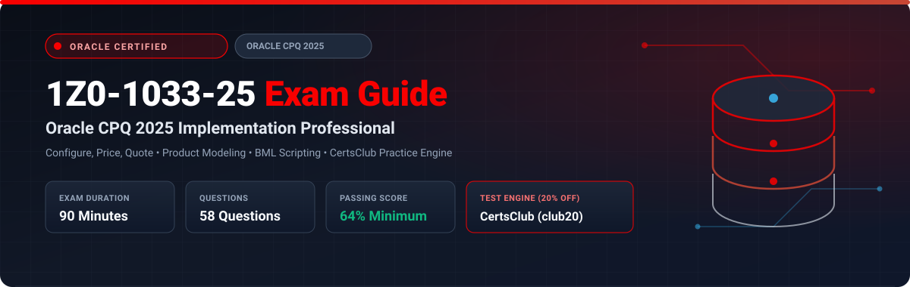

<p align="center">
  
</p>

# Oracle CPQ 2025 Implementation Professional (1Z0-1033-25) Exam Study Guide & Practice Test Resource Portal

[-f80000?style=for-the-badge&logo=oracle&logoColor=white)](https://education.oracle.com/)
[-f80000?style=for-the-badge&logo=oracle)](https://education.oracle.com/)
[](https://education.oracle.com/)
[](https://education.oracle.com/)
[](https://education.oracle.com/)
[-28a745?style=for-the-badge&logo=shield)](https://www.certsclub.com/oracle/)

---

## 1. Exam Overview & Candidate Profile

The **Oracle CPQ 2025 Implementation Professional (1Z0-1033-25)** exam certifies that an implementation specialist possesses the expertise needed to implement and administer Oracle Configure, Price, Quote (CPQ) Cloud applications. The exam measures your proficiency in architecting Product Configuration flows, building complex pricing and discount rules, establishing Commerce processes and approval workflows, developing custom logic via BigMachines Extensible Language (BML), designing quotes and contract proposals in Document Designer, and managing integrations with CRM and ERP backends.

Passing 1Z0-1033-25 earns the **Oracle CPQ 2025 Certified Implementation Professional** credential.

### Target Candidate Profile & Career Roles
* **Oracle CPQ Technical Consultants & Solution Architects**
* **Quote-to-Cash (QTC) Integration Specialists**
* **Enterprise Pricing & Commercial Operations Analysts**
* **Prerequisites:** Experience implementing Oracle CPQ Cloud, writing BML scripts, managing Configuration Rules, and deploying Commerce steps.

---

## 2. Key Exam Specifications

| Parameter | Official Specification |
| :--- | :--- |
| **Exam Code** | 1Z0-1033-25 |
| **Exam Title** | Oracle CPQ 2025 Implementation Professional |
| **Associated Credential** | Oracle CPQ 2025 Certified Implementation Professional |
| **Duration** | 90 Minutes |
| **Number of Questions** | 58 Questions |
| **Passing Score** | 64% |
| **Question Format** | Multiple Choice (Single and Multiple Select) |
| **Delivery Vendor** | Pearson VUE / Oracle University Online Remote Proctoring |
| **Recommended Practice Test Engine** | **[1Z0-1033-25 Practice Test - CertsClub](https://www.certsclub.com/oracle/)** (Coupon: `club20` for 20% off) |

---

## 3. Official Blueprint & Exam Domain Breakdown

| Domain Code | Domain Title | Weighting | Key Competencies Covered |
| :--- | :--- | :---: | :--- |
| **1.0** | **Product Configuration Modeling** | **25%** | Product Hierarchy (Product Families, Product Lines, Models); Configuration Attributes and Arrays; Configuration Rules (Constraint, Recommendation, Recommendation Item, Hiding rules); Bill of Materials (BOM) mapping. |
| **2.0** | **Commerce Processes & Workflow Management** | **25%** | Defining Commerce Processes; Attributes, Steps, and Actions; Formula and Rule configurations in Commerce; Approval workflows (Approval sequences, reasons, parallel approvals). |
| **3.0** | **Document Engine & Proposals** | **18%** | Document Designer layout components; Headings, repeating sections, line item tables; Dynamic conditional printing; DocuSign and e-signature integrations. |
| **4.0** | **BML Scripting & Advanced Logic** | **18%** | Writing and debugging BML (BigMachines Extensible Language) scripts; Advanced library functions; Database table lookups (`bmql`); Handling strings, arrays, dictionaries, and JSON in BML. |
| **5.0** | **Integration, Migration & Administration** | **14%** | Oracle CPQ REST APIs; Salesforce and Oracle Sales Cloud standard integrations; Migration Center deployment between environments; Bulk Data uploads and Data Tables. |

---

## 4. Deep Dive into Complex Exam Topics

### 4.1 BML Scripting & BMQL Query Optimization
* **BMQL Execution:** In BML, database tables are queried using `bmql` statements:
  ```bml
  results = bmql("SELECT sku, base_price FROM PricingTable WHERE model = $currentModel");
  for record in results {
      sku = get(record, "sku");
      price = getfloat(record, "base_price");
  }
  ```
* **Best Practice:** Avoid executing `bmql` statements inside loops (`for` or `while`). Bulk-fetch rows into memory dictionaries to prevent governor limit violations and performance degradation.

---

## 5. Scenario-Based Demo Questions & Technical Explanations

### Question 1: Configuration Rule Evaluation Order
**Scenario:** A solution architect designs a complex laptop product model in Oracle CPQ. When a user selects a 4K display, a Constraint Rule prevents selecting battery option A, while a Recommendation Rule sets default memory to 32GB.

In what sequence does Oracle CPQ execute rules during a user interaction on the Configuration flow?

A) Recommendation Rules -> Constraint Rules -> Hiding Rules  
B) Constraint Rules -> Recommendation Rules -> Recommendation Item Rules -> Hiding Rules  
C) Hiding Rules -> Constraint Rules -> Recommendation Rules  
D) All rules execute in parallel asynchronously  

**Correct Answer:** **B**

**Detailed Explanation:**
* During Configuration evaluation, Oracle CPQ strictly evaluates **Constraint Rules** first to validate attribute compatibility and enforce mandatory selections.
* **Recommendation Rules** execute next to pre-fill default values for valid configurations.
* **Recommendation Item Rules** then populate suggested catalog line items.
* Finally, **Hiding Rules** evaluate to determine visual display visibility of attributes on the user interface.

---

## 6. Recommended Preparation Strategy & Practice Testing Engine

To pass 1Z0-1033-25:

1. **Build Hands-On BML Functions:** Write and test BML scripts covering arrays, string parsing, and BMQL table lookups in a sandbox.
2. **Design End-to-End Quote Flows:** Configure multi-tier approval sequences in Commerce and generate dynamic customer proposals in Document Designer.
3. **Practice with Full-Length Mock Exams:** Use **[CertsClub Oracle 1Z0-1033-25 Practice Tests](https://www.certsclub.com/oracle/)**.
   * Updated for 2025 objectives with comprehensive scenario coverage.
   * Access verified answers and detailed technical rationales.
   * Use coupon code **`club20`** at checkout on [CertsClub](https://www.certsclub.com/oracle/) for an instant 20% discount.

---

## 7. Official Documentation & References

* [Oracle CPQ Administration and Developer Documentation](https://docs.oracle.com/en/cloud/saas/cpq/)
* [Oracle University 1Z0-1033-25 Certification Page](https://education.oracle.com/)
* [CertsClub 1Z0-1033-25 Practice Engine](https://www.certsclub.com/oracle/)

---

## 8. SEO & Discovery Keywords
```
1z0-1033-25, 1z0-1033-25 dumps, 1z0-1033-25 exam questions, oracle cpq 2025 exam,
oracle cpq implementation professional, 1z0-1033-25 practice test, certsclub 1z0-1033-25,
bml scripting cpq, document designer, bmql queries, cpq commerce workflow
```
